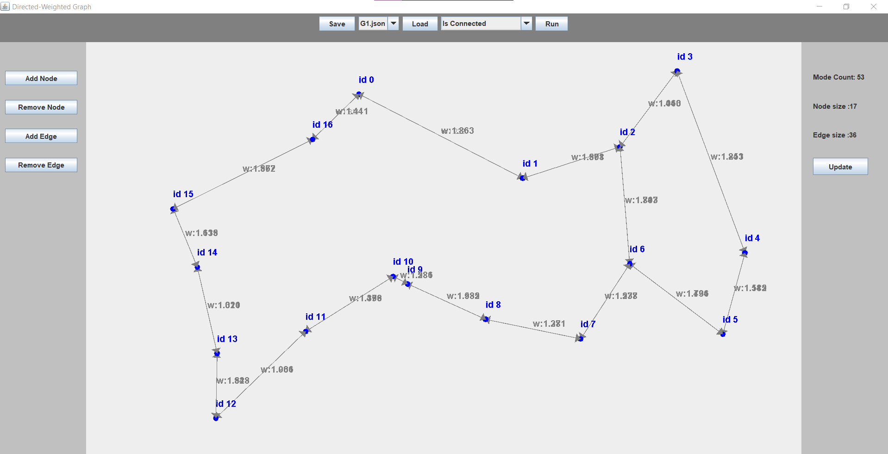

# OOP_EX2

we built a package protected classes for vertecies and edges.
the Graph class had a private edges and vertecies atrabutes.
It made sure they are "syncronised" with one another.
this data structures are semi-dynamic and allow to preforme basic operation
required for the project in constant or logorithmic time.

#### here is some farther explenation:

### TestResults( in ms):

+ 1000NODES
load: 216, 
center: 1750, 
isConnected: 0, 
shortestPath: 28
+ 10000NODES
load: 533, 
isConnected: 62, 
shortestPath: 424 
+ 100000NODES
load: 7217, 
isConnected: 1710, 
shortestPath: 82739

we havent manage to create a file for a 1000000 node graph.

however, the running time functions of the load and isConnected methods are liniar.
shortestPath, squre.
center and tsp, cubic.

so we can approximate the results

### Note!
when running the jar file you must enter as input the full directory of the jason file

## GUI
when running the jar file, it will open on the json prompted in the command line
or if none prompted it opens on G1 by default

### The file panel
On the upper panel we have the option to save, load and run algorithms on the displayed graph.

In order to save you must press the save button which will open a save window dialog. 

In order to load on of the json files, choose the desired file in the spinner next to the load button and then click load.

In order to run an algorithm, choose an algorithm first in the spinner next to the load button and press run.
Each algorithm will prompt a window with an answer or a query, please follow the instructions for the query.

### The edit panel
On the left panel we have the buttons for editing the graphs.
Each button will prompt a window with input request, please enter the input according the instruction

### the info panel
The left panel has general info on the graph: node and edge sizes and mode count.
It also has an update button. We recommend after each alteration on the graph to press it :) 

